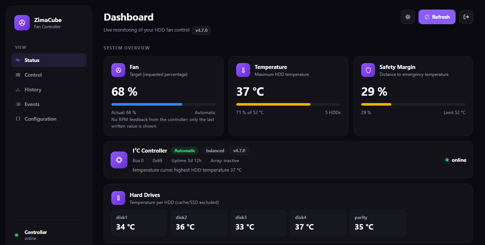

# ZimaCube Fan Controller

[](https://github.com/LeifistLive/zimacube-fan-controller/actions/workflows/ci.yml)
[](go.mod)
[](LICENSE)

Docker-based fan control for the ZimaCube backplane under Unraid. A Go
service reads HDD temperatures and array status, derives a target fan speed,
and writes it to the backplane controller over `i2cset` (i2c-tools) — with a
responsive web dashboard for monitoring and manual control.



## Contents

- [Features](#features)
- [Safety behavior](#safety-behavior)
- [Getting started](#getting-started)
- [Configuration](#configuration)
- [Commands](#commands)
- [Documentation](#documentation)
- [Development](#development)
- [License](#license)

## Features

**Control logic**

- Editable profiles (Silent, Balanced, Performance, Target Temp) with
  per-profile fan curves, array-boost, emergency, and hysteresis settings
- Target Temp profile: instead of following a fixed curve, step the fan
  speed up/down each cycle to keep the HDDs at or below a chosen
  temperature (e.g. 40 °C), still bounded by the active profile's
  emergency/array-boost/failsafe protections
- Automatic boost during parity check, rebuild, resync and clear
- Emergency protection via a configurable temperature threshold
- Safety speed whenever the HDD temperature cannot be read
- Hysteresis against oscillation, without holding a boost or emergency speed
- Only real HDDs (array data/parity members) count toward the reported
  temperature and disk count; cache/flash devices are excluded
- Periodic reapply of the active PWM value (`REAPPLY_INTERVAL_SECONDS`,
  default 300s) so a backplane controller reset does not go unnoticed;
  retried after 10s instead of the full interval right after a failed write
- Separate target vs. last-applied fan percent: the API and dashboard show
  what was requested and what was last actually written over I²C, since a
  failed write must not look like a successful one — there is no RPM/PWM
  feedback from the controller

**Dashboard**

- Responsive web dashboard (desktop, tablet and phone) with live status,
  history charts (hover for exact values), and per-HDD temperature tiles
- A single mode switch (Automatic / Manual / Emergency) plus manual test
  buttons; switch profiles (including Target Temp) from the profile table
- Event log with a filter for info/warning/critical severity, a selectable
  page size (10 or 25 per page), and a confirmation-gated clear action
- Light/dark theme toggle (defaults to dark)
- Browser tab title shows the live fan percent and temperature
  (e.g. "68% · 37°C – ZimaCube"), so it stays informative when backgrounded

**Security & API**

- Login screen protecting the whole dashboard (session cookie, bcrypt-hashed
  admin password); `GET /api/health` stays open for the Docker healthcheck
  and external monitoring
- REST API with per-category rate limiting, same-origin (CSRF) checks, and
  strict JSON parsing (unknown fields and trailing data are rejected)
- Manual fan tests are rejected if they would undercut the current
  emergency/failsafe/array-boost minimum, and only one test can run at a time

**Operations**

- Persistent configuration, history and events with automatic rotation and
  a `config_version` field for future migrations
- Docker healthcheck, read-only container, no capabilities
- GitHub CI with tests, golangci-lint (pinned version) and multi-arch GHCR
  publishing (linux/amd64, linux/arm64)

## Safety behavior

This order is deliberate and covered by tests:

1. The emergency temperature overrides everything else.
2. Array boost raises the speed, never lowers it.
3. If the HDD temperature cannot be read, the safety speed
   (`array_boost_percent` of the active profile) applies instead of the
   lowest curve step.
4. Manual overrides only apply within these limits.
5. Hysteresis only damps the automatic curve; it never holds a boost or
   emergency speed.

## Getting started

**1. Enable I²C on Unraid** — add to `/boot/config/go`, before `emhttp`
starts:

```bash
modprobe i2c-dev
modprobe i2c-i801
```

**2. Deploy.** [docker-compose.yml](docker-compose.yml) pulls the prebuilt
image `ghcr.io/leifistlive/zimacube-fan-controller:latest` (published for
linux/amd64 and linux/arm64 on every push to `main` and on version tags) —
deploy it as a Portainer stack (Git repository or pasted compose) and enable
**Re-pull image** so redeploying picks up new releases. See
[docs/INSTALL.md](docs/INSTALL.md) for the full walkthrough, including how
to build from source locally instead if you've changed the code.

Either way, set the variables from [.env.example](.env.example) as stack
environment variables, at minimum `ADMIN_PASSWORD`.

**3. Open the dashboard:**

```text
http://<unraid-ip>:8086/
```

## Configuration

Every value comes from environment variables. Invalid values are logged and
clamped to a valid range instead of starting the service and surprising you
later.

| Variable | Default | Description |
| --- | --- | --- |
| `ADMIN_USER` | `admin` | Login username. |
| `ADMIN_PASSWORD` | *(empty)* | Login password. Empty disables login and opens the whole dashboard — set a strong password before the dashboard is reachable on the LAN. |
| `BIND_ADDRESS` | `0.0.0.0` | Host address the container port is published on (Compose only). |
| `HOST_PORT` | `8086` | Host port the dashboard is published on (Compose only). |
| `I2C_BUS` | `0` | I²C bus number the backplane controller is on. |
| `I2C_ADDRESS` | `0x69` | I²C address of the backplane controller. |
| `I2C_TIMEOUT_SECONDS` | `5` | Timeout for a single I²C operation. |
| `I2C_RETRIES` | `3` | Write attempts before giving up for a cycle. |
| `CHECK_INTERVAL_SECONDS` | `15` | How often the control loop evaluates temperature and mode. |
| `HISTORY_INTERVAL_SECONDS` | `300` | How often a history point is recorded. |
| `DETECT_INTERVAL_SECONDS` | `300` | How often the controller is re-probed while healthy. |
| `REAPPLY_INTERVAL_SECONDS` | `300` | How often the active PWM is rewritten even without a change. |
| `MAX_LOG_LINES` | `20000` | Rotation threshold for `history.jsonl` and `events.jsonl`. |
| `SAFE_SHUTDOWN_PERCENT` | `0` | Fan speed written on shutdown; `0` leaves the last value in place. |
| `TZ` | `Europe/Berlin` | Container timezone, used for log and event timestamps. |

Login: with `ADMIN_PASSWORD` set, every route except `GET /login`,
`POST /login` and `GET /api/health` requires a session. Cross-site requests
are rejected regardless of login state.

Storage: the service only ever reads Unraid's own `disks.ini`/`var.ini`
(RAM-backed status files emhttp maintains itself) and talks I²C to the
backplane's fan controller chip — never to the drives — so polling never
wakes a spun-down disk. The one thing to keep an eye on is `/data` (config,
override, history, events): keep it on the `fan-data` Docker volume as
shipped (Docker's data-root, normally cache/boot on Unraid). History/event
writes happen every few minutes even when nothing changes; re-mounting
`/data` onto an array disk would wake it up on that same schedule.

## Commands

```bash
docker exec zimacube-fan-controller fanctl status
docker exec zimacube-fan-controller fanctl health
docker exec zimacube-fan-controller fanctl 75
docker exec zimacube-fan-controller fanctl auto
docker exec zimacube-fan-controller fanctl emergency
docker exec zimacube-fan-controller fanctl profile performance
docker exec zimacube-fan-controller fanctl test 50
```

`fanctl` logs in with `ADMIN_USER`/`ADMIN_PASSWORD` from the container
environment automatically and caches the session cookie in
`/tmp/fanctl-session`.

## Documentation

| Document | Covers |
| --- | --- |
| [docs/INSTALL.md](docs/INSTALL.md) | Step-by-step Portainer setup and post-deployment checks |
| [docs/API.md](docs/API.md) | Full REST API: auth, endpoints, rate limits, status fields |
| [CHANGELOG.md](CHANGELOG.md) | Version history |

## Development

Requires Go 1.24+.

```bash
go build ./...
go vet ./...
go test -race ./...
gofmt -w .
golangci-lint run
```

These are the same checks CI runs on every push; `docker compose config` and
a full `docker build` run in CI as well.

## License

[MIT](LICENSE)
